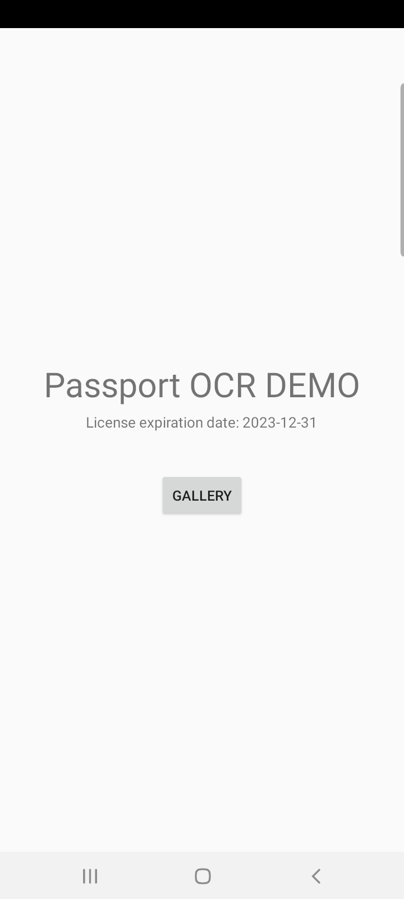
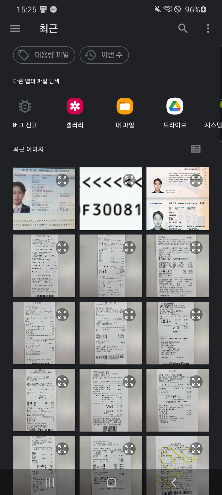
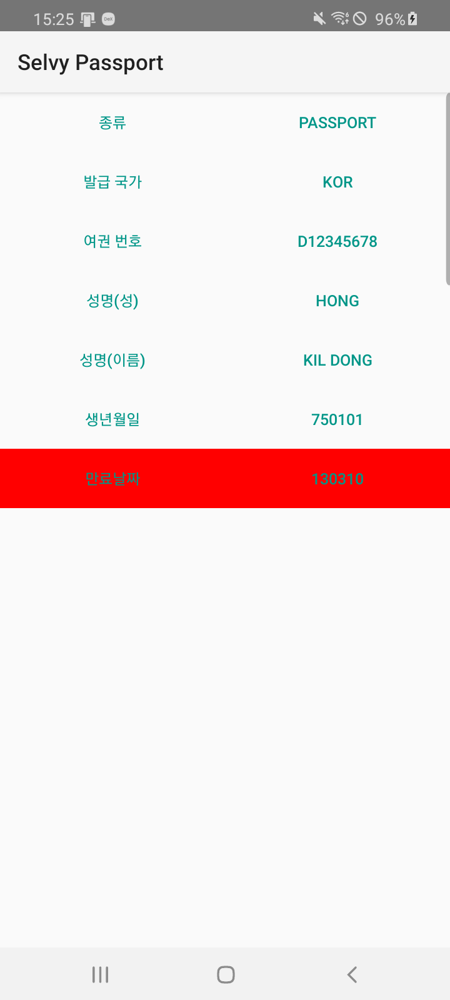

# 여권 인식기 안드로이드 예제
다음은 여권 인식기 SDK를 활용한 코드 예시입니다.

## 실행 환경
- 운영 체제: Android 4.0 이상의 ARM CPU 기반 장치
- 인식 대상: 여권상의 MRZ (Machine Readable Zone) 글자
- 런타임 메모리(RAM): 100MB ~ 290MB(Samsung Galaxy S7 기준)
- ROM: 3.5MB
- 예제 개발 환경: Android Studio

## 문서
The **Selvy OCR SDK** API documentation is available on [Selvy OCR website](http://ocr.selvasai.com)

## Screenshot
* 실행

* 이미지 선택

* 결과

## License
© 2020. [SELVAS AI Inc.](http://www.selvasai.com) All Rights Reserved.
